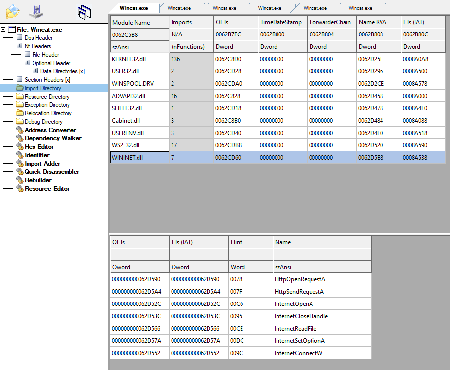
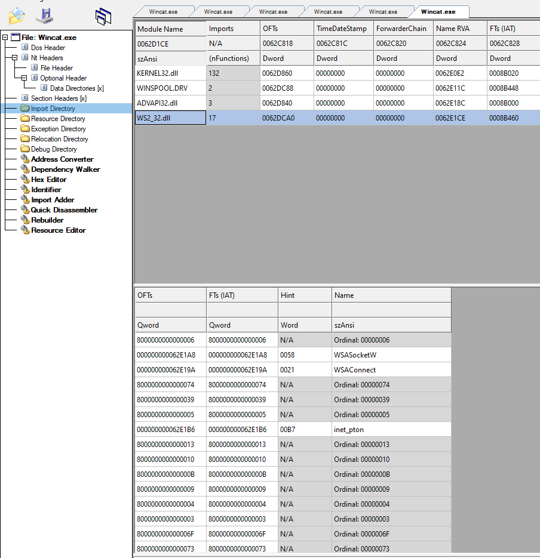

# Wincat

```text
Wincat is a custom revershell with no Anti-malware detection and more features
```

## Anti-malware online

### Anti-scan.me


Source: <https://antiscan.me/scan/new/result?id=nzov7HmjbQ2a>

### jotti


Source: <https://virusscan.jotti.org/en-US/search/hash/b002af8d7daef15484757d72b7ce41f6>

## Obfuscation

### Dynamic loading function

#### Generate C files

`genAPIFiles.exe filetoload.conf`

```sh
     ___  ______ _____   _____  _____ _   _  ___________  ___ _____ ___________
    / _ \ | ___ \_   _| |  __ \|  ___| \ | ||  ___| ___ \/ _ \_   _|  _  | ___ \
   / /_\ \| |_/ / | |   | |  \/| |__ |  \| || |__ | |_/ / /_\ \| | | | | | |_/ /
   |  _  ||  __/  | |   | | __ |  __|| . ` ||  __||    /|  _  || | | | | |    /
   | | | || |    _| |_  | |_\ \| |___| |\  || |___| |\ \| | | || | \ \_/ / |\ \
   \_| |_/\_|    \___/   \____/\____/\_| \_/\____/\_| \_\_| |_/\_/  \___/\_| \_|


[-] Create file for API Call
        [i] Static Header detected.
        [!] Warrning the function argument is not upper case (STR: '(SOCKET,CONST struct sockaddr*,INT)' LINE: 75) !
        [!] Warrning the return type is not upper case (STR: 'unsigned long' LINE: 77) !
        [i] 4 comments detected.
        [*] Read file successfully
        [*] Hash function successfully
                [i] 8 dlls loaded.
                [i] 82 functions loaded.
        [*] File was LoadAPI(.h/.c) created successfully
        [*] File was CalcAPI(.h/.c) created successfully
        [*] File was Decryption(.h/.c) created successfully
```

#### Result

Before:



After:

